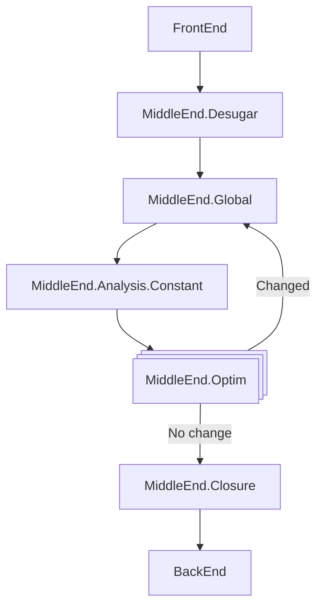

# Flowchart of the middle-end

```mermaid
flowchart TD
    FrontEnd@{shape: rect, label: "FrontEnd"}
    BackEnd@{shape: rect, label: "BackEnd"}
    Desugar@{shape: rect, label: "MiddleEnd.Desugar"}
    Global@{shape: rect, label: "MiddleEnd.Global"}
    Analysis@{shape: rect, label: "MiddleEnd.Analysis.Constant"}
    Optim@{shape: processes, label: "MiddleEnd.Optim"}
    Closure@{shape: rect, label: "MiddleEnd.Closure"}
    FrontEnd --> Desugar
    Desugar --> Global
    Global --> Analysis
    Analysis --> Optim
    Optim -->|Changed| Global
    Optim -->|No change| Closure
    Closure --> BackEnd
```